# LinuxMinimalOS-v2.0

LinuxMinimalOS-v2.0 es un mini sistema operativo GNU/Linux construido desde un script desarollado en lenguaje BASH. en su segunda versión, este llega  con nuevas herramientas, el cual "ENSAMBLA" un sistema base GNU/LInux Minimalista, y nos ofrece servicios nuevos como calculadora, servidor SSH, un servidor web entre otras, aca el listado de sus nuevas funciones y herramientas.

> Lista de herramientas añadidas
1.  bc 1.06.95 
2.  zlib-1.2.8 
3.  pcre2-10.20 
4.  e2fsprogs-1.43.1 
5.  dropbear-2016.74 
6.  lighttpd-1.4.41 
7.  iptables-1.6.0 
8.  sqlite-3.14.1 
9.  cdrkit-1.1.11
10. perl-5.8.8 

El usuario para acceso es:
```
user:root 
```
Tambien cuenta con un usuario ```www``` para la administración del servidor se puede cambiar la contraseña de este usuario desde el usuario root.

Para su construcción se hace lo siguiente.

El archivo sasaga.sh contiene todo el código fuente para la creación del sistema linux minimalista basta solo con ejecutarlo

```
cd carpeta_proyecto
sudo ./sasaga.sh
```

Se generará una imagen ISO al final de la compilación y ya pueden tener la base de un sistema linux minimalista, ¿listo para empezar armar el suyo completamente desde cero?


Puedes colaborar a que siga creando nuevas herramientas con una donación en [Paypal](https://www.paypal.com) al correo ssanchezga@ufpso.edu.co
by [@sasaga92](https://twitter.com/sasaga92)


Breve galeria en funcionamiento LinuxMinimalOS-v2.0

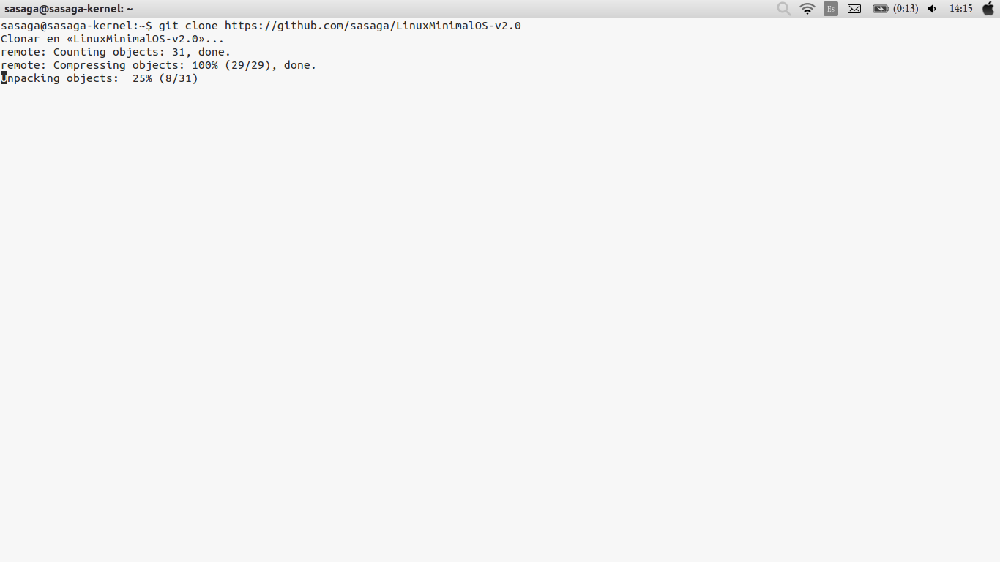
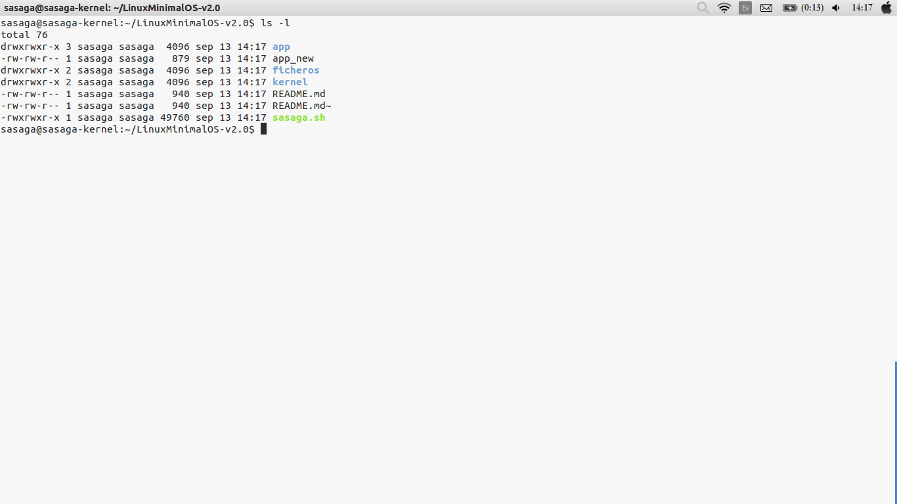
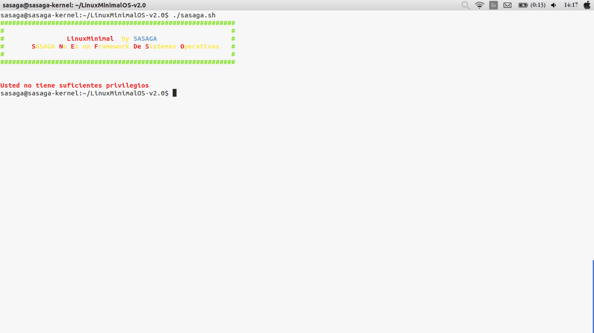
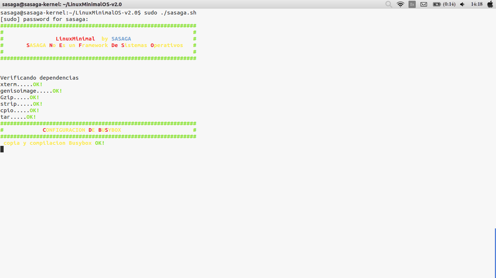
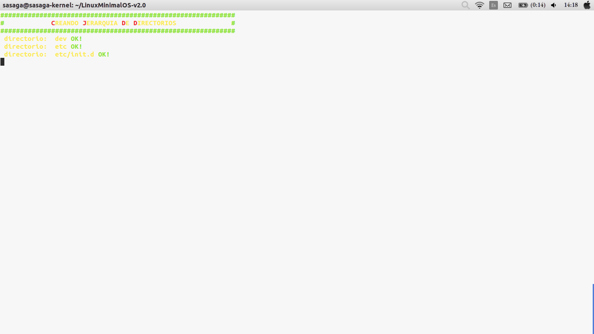
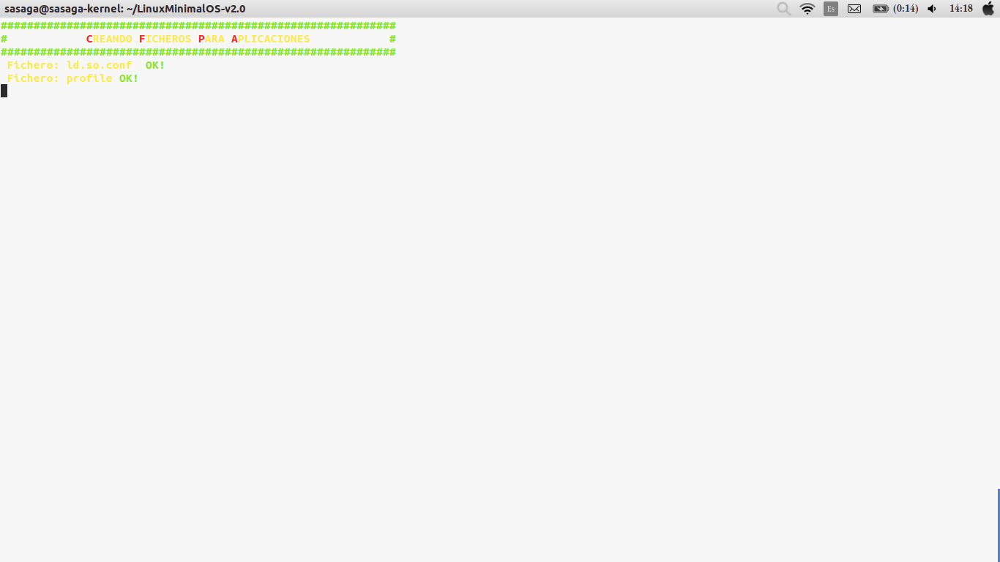
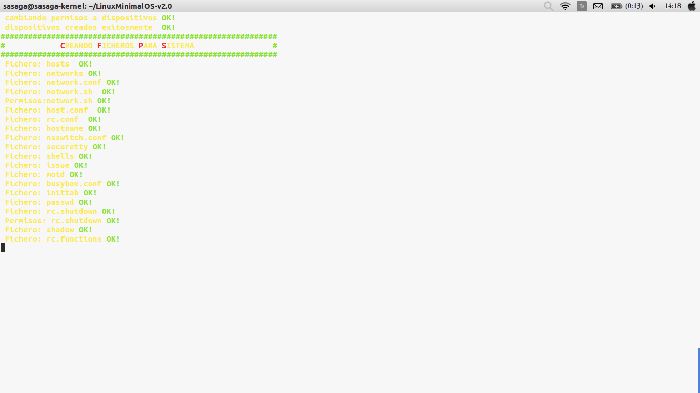
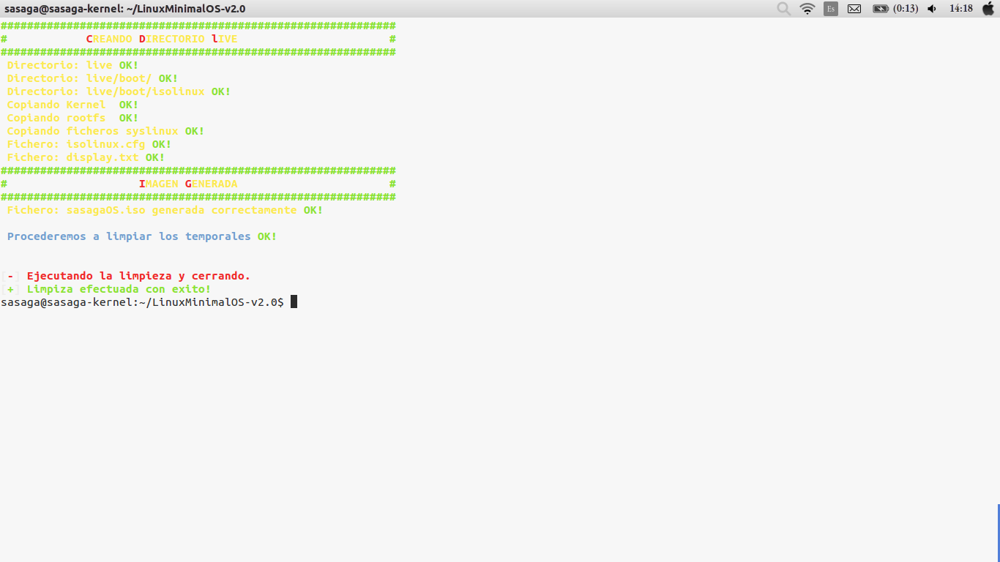


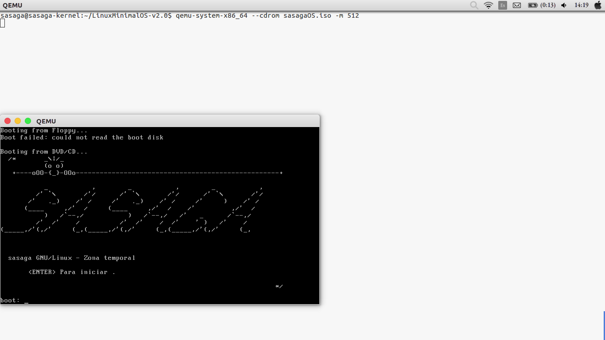

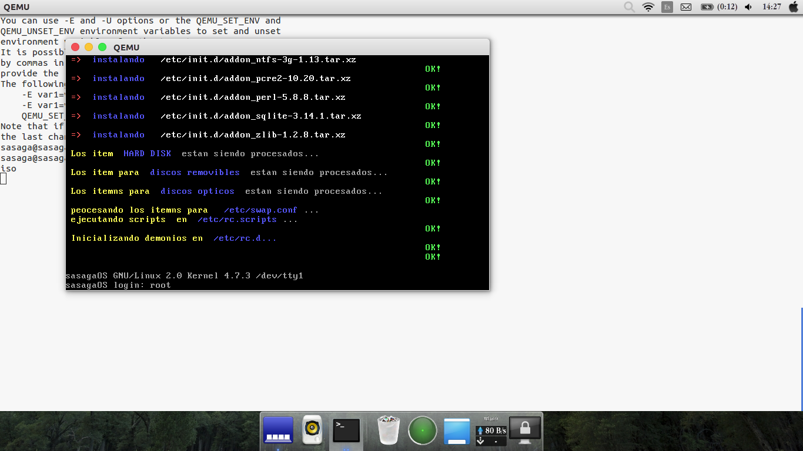
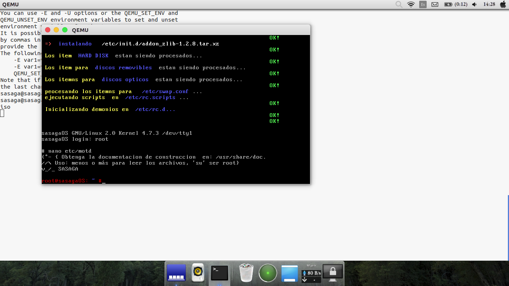
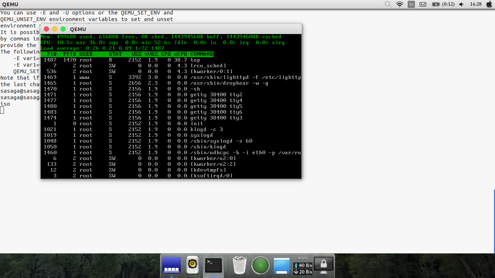
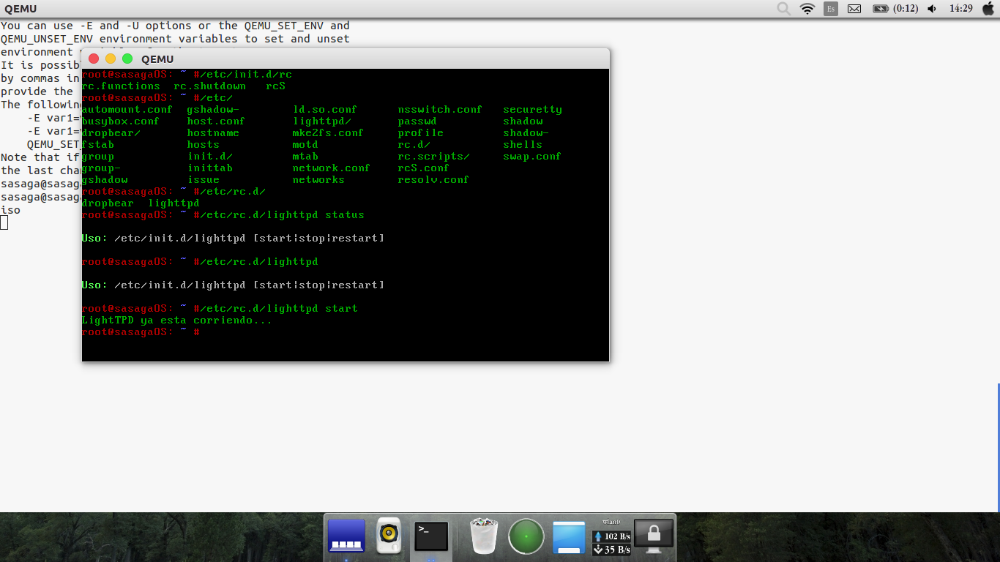
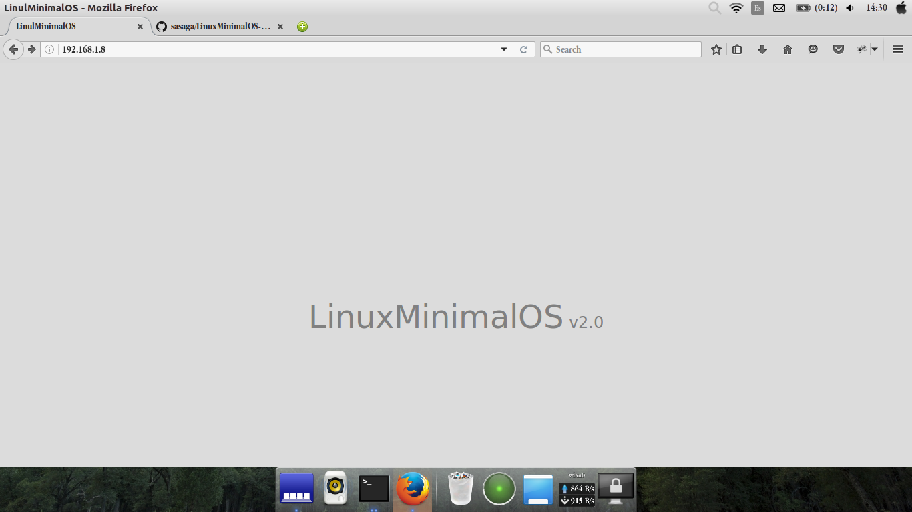
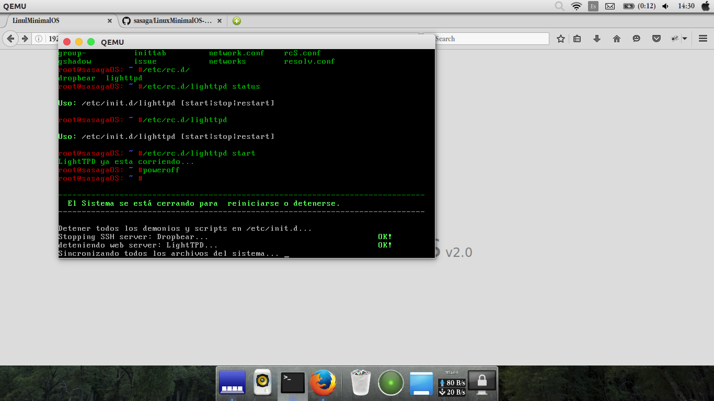

;) happy hacking!!!
