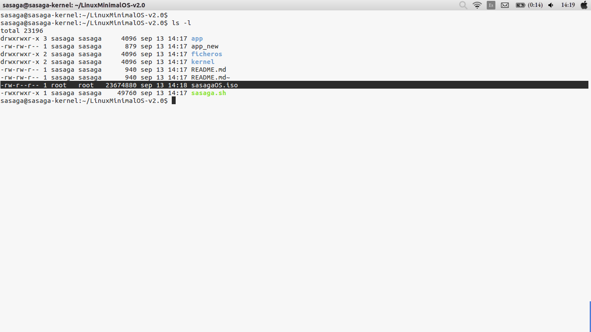
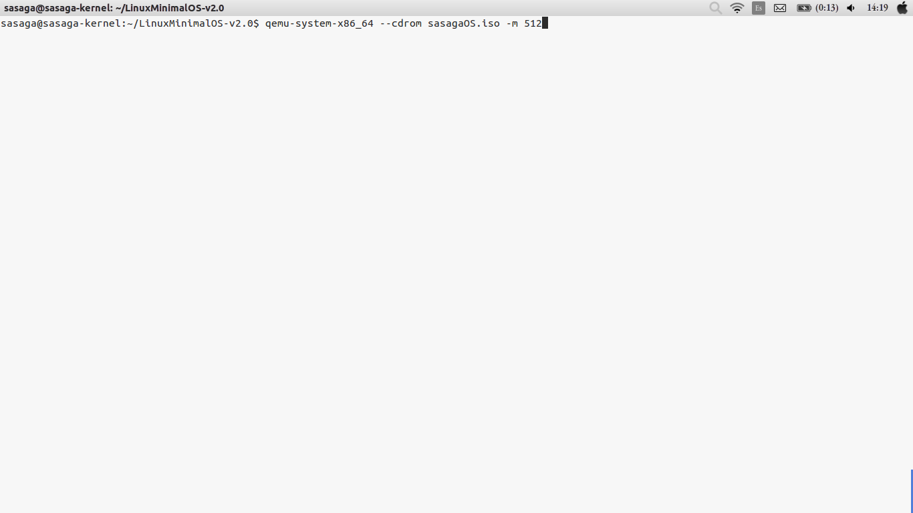

# Minimal v2.0

este es un software desarollado completamente en lenguaje BASH en su segunda version con nuevas herramientas
el cual intenta "ENSAMBLAR" un sistema base GNU/LInux Minimalista, y en esta segunda version se añaden herramientas importantes:

1.  bc 1.06.95 
2.  zlib-1.2.8 
3.  pcre2-10.20 
4.  e2fsprogs-1.43.1 
5.  dropbear-2016.74 
6.  lighttpd-1.4.41 
7.  iptables-1.6.0 
8.  sqlite-3.14.1 
9.  cdrkit-1.1.11
10. perl-5.8.8 

user:root

su uso es el siguiente:
el archivo sasaga.sh contiene todo el codigo fuente para la creacion del sistema linux minimalista basta solo con ejecutarlo

cd carpeta_proyecto
sudo ./sasaga.sh

se generara una imagen ISO al final de la compilacion y ya pueden tener la base de un sistema linux minimalista, ¿listo para empezar armar el suyo completamente desde cero?

pudes colaborar a que siga creando nuevas herramientas con una donacion en Paypal al correo ssanchezga@ufpso.edu.co
by @sasaga92

breve galeria en funcionamiento LinuxMinimalOS-v2.0

